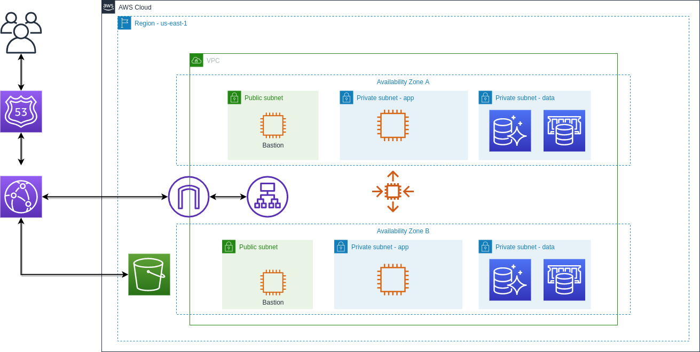

# VPC - Virtual Private Cloud

## Description
This template deploys a VPC, with a public and private subnets spread across two Availability Zones. It also deploys an Internet Gateway, with a default route on the public subnets.

## Getting Started
TDB

## Overview

